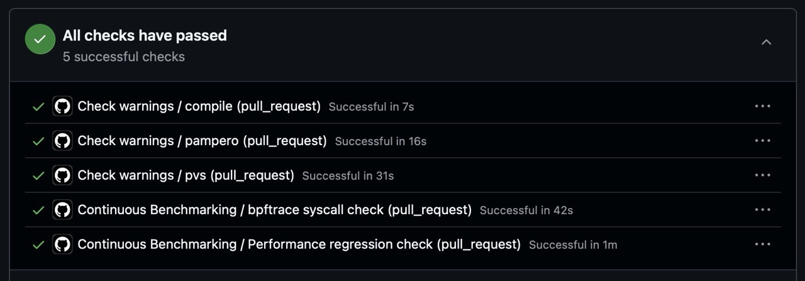
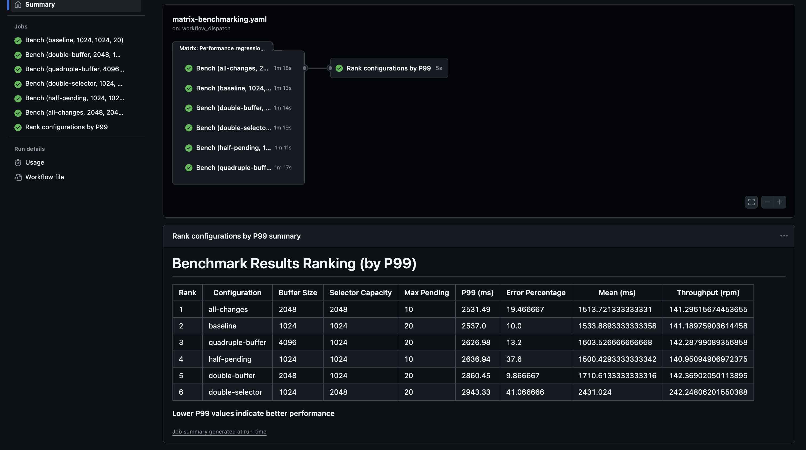

# Socks 5 Proxy - Grupo 01

## 1. Indice

- [Socks 5 Proxy - Grupo 01](#socks-5-proxy---grupo-01)
  - [1. Indice](#1-indice)
  - [2. Descripción](#2-descripción)
  - [3. Problemas encontrados durante el diseño y la implementación](#3-problemas-encontrados-durante-el-diseño-y-la-implementación)
  - [4. Limitaciones de la aplicación](#4-limitaciones-de-la-aplicación)
  - [5. Posibles extensiones](#5-posibles-extensiones)
  - [6. Conclusiones](#6-conclusiones)
  - [7. Ejemplos de prueba](#7-ejemplos-de-prueba)
  - [8. Guía de instalación](#8-guía-de-instalación)
  - [9. Instrucciones para la configuración](#9-instrucciones-para-la-configuración)
    - [9.1 Variables](#91-variables)
  - [10. Ejemplos de configuración y monitoreo](#10-ejemplos-de-configuración-y-monitoreo)
  - [11. Documento de diseño del proyecto](#11-documento-de-diseño-del-proyecto)
  - [12. Extras](#12-extras)
    - [12.1 Matriz de Benchmarks](#121-matriz-de-benchmarks)
    - [12.2 bpftrace y monitoreo de syscalls bloqueantes](#122-bpftrace-y-monitoreo-de-syscalls-bloqueantes)
    - [12.3 Complilación y pruebas con Docker](#123-complilación-y-pruebas-con-docker)

## 2. Descripción

El presente detalla el desarrollo de un proxy para el protocolo SOCKSv5\[[RFC1928](https://datatracker.ietf.org/doc/html/rfc1928)\].
El protocolo implementa autenticación siguiendo los lineamientos de [RFC1929](https://datatracker.ietf.org/doc/html/rfc1929).

## 3. Problemas encontrados durante el diseño y la implementación

Algunas dificultades encontradas durante el desarrollo del proyecto incluyen:

* La falta de tareas paralelizables en etapas tempranas del desarrollo, lo que dificultó la distribución del trabajo entre los miembros del equipo. Para solventar esto, [se optó por probar ciertos estados de forma sintética mediante tests](../tests/copy_test.c) utilizando la libreria libcheck. En particular, se implementaron tests para el estado de copia de datos entre el cliente y el servidor de origen, utilizando mocks de las funciones send y recv para emular la transferencia de datos sin necesidad de establecer conexiones reales y/o interoperar con el sistema operativo. Esto permitió validar el correcto funcionamiento de la lógica de copia de datos y asegurar que los buffers se manejaran adecuadamente.
* El mantener la calidad de código y consistencia durante el desarrollo. Un reto que se afrontó de manera temprana con dos herramientas:
  * Pre-commit hooks: Se implementaron hooks pre-commit que formattearan el código automáticamente utilizando [clang-format](../.clang-format) y [clang-tidy](../.clang-tidy). Esto aseguró que todo el código comprometido siguiera un estilo consistente, facilitando su lectura y mantenimiento.
  * Análisis estático de código: Se utilizó PVS-Studio para realizar análisis estáticos de código de manera automática en cada push y pull request a la rama main. Esto ayudó a identificar posibles errores, vulnerabilidades y problemas de calidad en el código antes de que fueran integrados.
* Complejidad para evaluar la performance del proxy bajo diferentes condiciones de carga. Se utilizó la herramienta [Apache JMeter](https://jmeter.apache.org/) para crear escenarios de prueba que simularan múltiples conexiones concurrentes. Así mismo, se utilizó bpftrace para monitorear cualquier uso de syscall bloquantes en el servidor. Para facilitar la ejecución de estas pruebas, se optó por correrlas en Github Actions, permitiendo así la automatización de las mismas y la obtención de resultados consistentes.
  
  Si bien le ejecución de pruebas de performance en Github Actions presentó ciertas limitaciones debido a la falta de control sobre el entorno de ejecución, se observó que las fluctuaciones provenientes de estos [estaban entre 10% y 20%](https://github.com/marketplace/actions/continuous-benchmark-with-pr-comments?utm_source=chatgpt.com#stability-of-virtual-environment), lo cual se decidió tolerar a costa de estandarizar y automatizar la ejecución de las pruebas. Estas pruebas se corrieron sobre cada pull request y push a la rama main.

## 4. Limitaciones de la aplicación

## 5. Posibles extensiones

Existen diversas líneas de trabajo que permitirían ampliar y mejorar el alcance del proyecto. En primer lugar, podría incorporarse soporte para los comandos BIND y UDP ASSOCIATE del protocolo SOCKS5, lo cual habilitaría un conjunto más completo de funcionalidades y haría la implementación compatible con un mayor número de casos de uso.

Otra posible extensión consiste en la incorporación de multithreading, permitiendo manejar múltiples solicitudes de manera concurrente y mejorando significativamente el rendimiento del sistema.

Finalmente, una mejora en la interfaz del cliente permitiría ofrecer una experiencia de uso más clara y eficiente, facilitando la interacción con las distintas funcionalidades del servicio.

## 6. Conclusiones.

Este proyecto representó un gran desafío para el equipo, ya que requirió un profundo entendimiento de los distintos protocolos de comunicación. El trabajo resultó complejo pero satisfactorio, dado que plantea casos de uso reales.

La implementación del SOCKS5, del protocolo propio y del cliente brindó al equipo una perspectiva amplia acerca de lo que implica trabajar con protocolos de comunicación. Además de la implementación en sí, se adquirieron conocimientos sobre el diseño y la lectura de protocolos, dado que un buen diseño y una documentación adecuada hacen que el desarrollo sea mucho más eficiente.

## 7. Ejemplos de prueba

## 8. Guía de instalación

Para compilar y correr el proxy SOCKSv5, se deben seguir los siguientes pasos:

```sh
# Compilar el proyecto
make
```

```sh
# Correr el servidor
./bin/server
```
Para poder conectarse a PAM mediante el cliente:

```sh
# Correr el cliente
./bin/client <command>
# Para consultar los distintos commandos y opciones se puede ejecutar
./bin/client -h
```

## 9. Instrucciones para la configuración

### 9.1 Variables

Se pueden modificar algunas constantes fácilmente definiendo variables de entorno. Estas se van a tomar de un archivo `.env` en la raíz del proyecto. Se puede usar el [`.env.sample`](./.env.sample) provisto como punto de partida.

Algunas de las variables disponibles para su modificación incluyen:

| Variable             | Descripción                                                                                                                                     | Valor por Defecto |
|----------------------|-------------------------------------------------------------------------------------------------------------------------------------------------|-------------------|
| `DEBUG`              | Habilita flags de compilación para debug (-g, -fsanitize=address, etc).                                                                         | `true`            |
| `TRACE`              | Habilita el monitoreo con `bpftrace` para syscalls bloqueantes al ejecutar server.sh (el entrypoint del servicio `server` en docker).           | `false`           |
| `BUFFER_SIZE`        | Tamaño del buffer usado para leer/escribir datos entre sockets.                                                                                 | `1024`            |
| `MAX_LOG_QUEUE_SIZE` | Cantidad máxima de mensajes de log que pueden estar en cola antes de descartar logs.                                                            | `100`             |
| `MAX_LOG_SIZE`       | Tamaño máximo (en bytes) de un mensaje de log individual. Los mensajes más largos se van a truncar con puntos suspensivos.                      | `1024`            |
| `LOGGER_MIN_LEVEL`   | Nivel mínimo de log a registrar. Valores posibles: `LOGGER_TRACE`, `LOGGER_DEBUG`, `LOGGER_INFO`, `LOGGER_WARN`, `LOGGER_ERROR`, `LOGGER_FATAL` | `LOGGER_INFO`     |

Todas las variables del servidor y sus valores por defecto se pueden encontrar en [defines.h](./src/server/include/defines.h).

Además, la variable `MOCK_ETC_HOST` puede ser definida para establecer un archivo alternativo al `/etc/hosts` del sistema host, el cual será montado en el contenedor Docker del servidor proxy. Esto es útil para pruebas de integración y performance, ya que permite controlar la resolución DNS.

## 10. Ejemplos de configuración y monitoreo

### Ejemplos de monitoreo

El protocolo PAM perminte monitorear el servidor de socks5 ofreciendo métricas y estadísticas del funcionamiento de este. También ofrece opciones para poder gestionar usuarios que pueden obtener esta información. 

Para poder conectarse a PAM se ofrece un cliente que puede conectarse tanto con IPV4 como IPV6. La estructura de las request es la siguiente:
```
Usage: ./bin/client [OPTIONS] [COMMAND] [ARGS]

Options:
   -h                                       Print help and exit.
   -v                                       Print version info and exit.
   -L HOST                                  Specify remote host (default: 127.0.0.1).
   -P PORT                                  Specify connection port (default: 8080).
   -u USER:PASS                             Authentication credentials.

Commands:
   users                                    Request list of users.
   metrics                                  Get server metrics.
   add-user <username> <password> <role>    Add a user.
   remove-user <username>                   Remove a user.
   change-Password <username> <password>    Change password.
   change-role <username> <role>            Change role.
```

Algunos ejemplos de pedidos son:

**users** `./bin/client -L 127.0.0.1  -P 8080 -u admin:admin users`
```
Connecting to host 127.0.0.1 and port 8080...
Connected to server at 127.0.0.1:8080
Sending authentication...
Authentication successful
Server response to authentication: VER=0x01, STATUS=0x00
Sending request: VER=0x01, METHOD=0x0001, NBODY=0 bytes

[GET_USERS] Response received:
  VER:    0x01
  STATUS: 0x00 (Success)
  NBODY:  43 bytes
  BODY:   +OK listing users
@admin
```

**add-user** `./bin/client -L 127.0.0.1  -P 8080 -u admin:admin add-user new_usr pass 1`
```
Connecting to host 127.0.0.1 and port 8080...
Connected to server at 127.0.0.1:8080
Sending authentication...
Authentication successful
Server response to authentication: VER=0x01, STATUS=0x00
Sending request: VER=0x01, METHOD=0x0002, NBODY=14 bytes

[ADD_USER] Response received:
  VER:    0x01
  STATUS: 0x00 (Success)
  NBODY:  0 bytes
```

**metrics** `./bin/client -L 127.0.0.1  -P 8080 -u admin:admin metrics`

```
Connecting to host 127.0.0.1 and port 8080...
Connected to server at 127.0.0.1:8080
Sending authentication...
Authentication successful
Server response to authentication: VER=0x01, STATUS=0x00
Sending request: VER=0x01, METHOD=0x0006, NBODY=0 bytes

[GET_METRICS] Response received:
  VER:    0x01
  STATUS: 0x00 (Success)
  NBODY:  109 bytes
  BODY:   +OK Metrics snapshot
Current Connections: 0
Total Connections: 0
Total Bytes Sent: 0
Total Bytes Received: 0
```

## 11. Documento de diseño del proyecto

El proyecto cuenta con los siguientes módulos principales:
- [src/shared/](../src/shared/): Contiene código compartido entre el cliente y el servidor, incluyendo definiciones de estructuras de datos y funciones utilitarias.
- [src/server/](../src/server/): Implementa la lógica del servidor proxy SOCKSv5, incluyendo el manejo de conexiones entrantes, autenticación y transferencia de datos.
- [src/client/](../src/client/): Implementa el cliente de [nuestro protocolo](./PROTOCOL.md)
- [tests/](../tests/): Contiene tests unitarios y de integración para validar el correcto funcionamiento del proxy.
- [docs/](../docs/): Documentación del proyecto, incluyendo este reporte y el documento de diseño.
- [scripts/](../scripts/): Scripts auxiliares para la compilación, ejecución de pruebas y otras tareas relacionadas con el desarrollo. (Utilizados principalmente como entrypoints de contenedores Docker).
- [.github/workflows/](../.github/workflows/): Configuraciones de Github Actions para CI y pruebas automatizadas.

## 12. Extras

### 12.1 Matriz de Benchmarks

Para poder probar el proxy bajo condiciones de carga y encontrar la mejor configuración de parámetros, se utilizó [Apache JMeter](https://jmeter.apache.org/) para crear escenarios de prueba que simularan múltiples conexiones concurrentes. Los scripts de JMeter se encuentran en la carpeta [bench/jmeter](./bench/jmeter). Estas pruebas de carga se corrieron contra una matriz variada de parámetros (compilando con mayor y menor tamaño de buffer, mayor y menor capacidad de selectores, etc.) y los resultados se evaluaron de acuerdo a su porcentaje de error en respuesta a las conexiones y el tiempo de respuesta (p99 y media). La ejecución de estas pruebas se automatizó utilizando Github Actions, permitiendo así la obtención de resultados consistentes y la comparación entre distintas configuraciones.



Los resultados de estas pruebas se pueden encontrar en la sección de "Actions" del repositorio, en el workflow titulado "Matrix Benchmarking". Cada corrida genera un reporte detallado con las métricas obtenidas para cada configuración probada.

### 12.2 bpftrace y monitoreo de syscalls bloqueantes

Para asegurar que no se bloqueara inecesariamente en syscalls de lectura y escritura, se utilizó `bpftrace` para monitorear las syscalls bloqueantes durante la ejecución del servidor proxy.

El monitoreo con `bpftrace` se puede habilitar facilmente al correr el servidor utilizando la variable de entorno `TRACE=true`. Esto hace que el entrypoint del contenedor Docker para el servidor ejecute el script de `bpftrace` junto con el servidor proxy, registrando cualquier syscall bloqueante que ocurra durante su ejecución. Al correr en docker, se estandarizó el entorno y facilitó la ejecución del monitoreo sin necesidad de instalar `bpftrace` directamente en el sistema host.


Esta herramienta ayudó a identificar y solucionar problemas relacionados con bloqueos innecesarios, mejorando así la performance y capacidad de respuesta del proxy bajo condiciones de carga.

### 12.3 Complilación y pruebas con Docker

Si bien el proyecto puede compilarse y correrse directamente en un entorno local con `make`, se proveen contenedores Docker para facilitar la compilación, ejecución y pruebas del proxy SOCKSv5 en un entorno estandarizado.

El uso de docker permitió contar con entornos estandarizados para la compilación y pruebas, y facilitó el uso de herramientas adicionales como `bpftrace` para monitoreo y `Apache JMeter` para pruebas de carga.

A su vez, el sistema de contenedores y red de docker permitió facilmente asignar direcciones IPv4 e IPv6 fijas a los contenedores, controlar el DNS, y modificar el archivo /etc/host para simular la resolución DNS, facilitando la ejecución de pruebas de integración y performance entre el cliente, el servidor proxy y servidores de prueba.

Durante las pruebas de performance, se utilizó un archivo `/etc/hosts` personalizado para controlar la resolución DNS de los servidores de prueba. Este archivo se monta en el contenedor del servidor proxy utilizando la variable de entorno `MOCK_ETC_HOST`, permitiendo así simular diferentes escenarios de resolución DNS sin afectar el sistema host. En particular, el dominio `fakegoogle.com` se mapea a las direcciones IPv4 e IPv6 del contenedor `nginx-test-server`, permitiendo así evaluar la capacidad del proxy para FQDNs y resolución DNS sin depender de las condiciones externas de la red.
